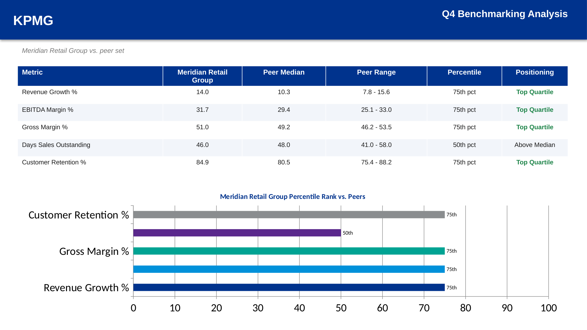
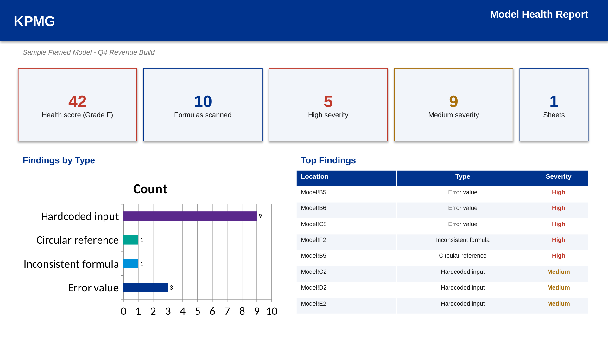
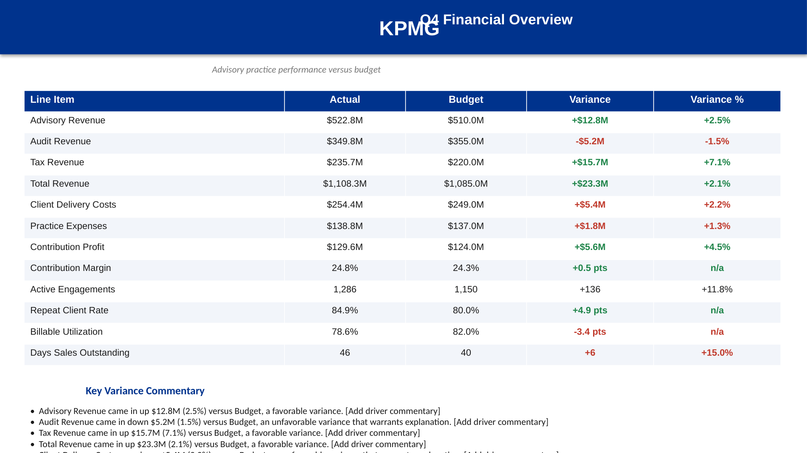
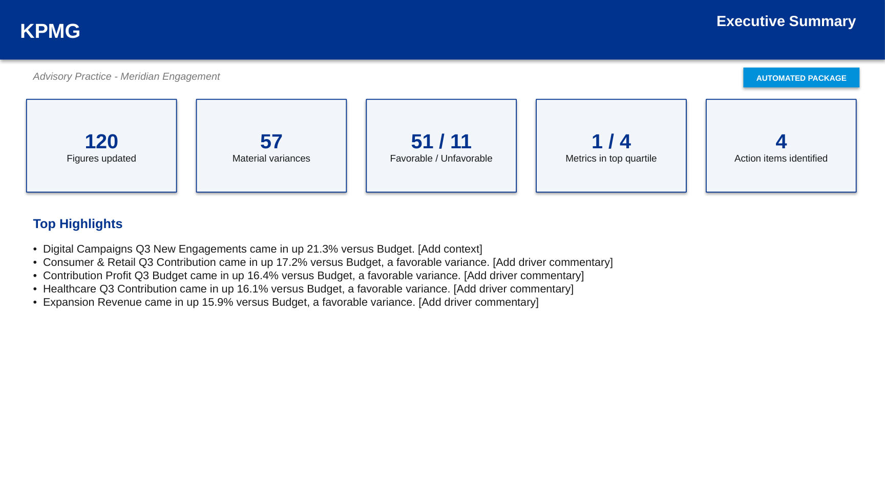
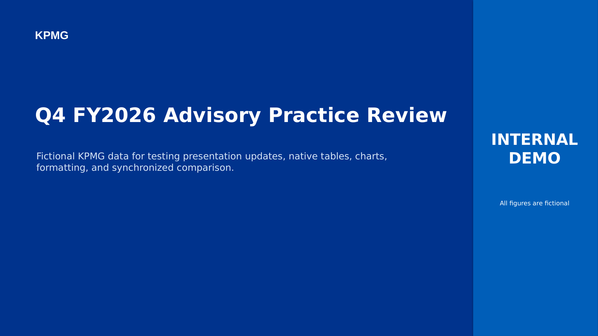

# KPMG Work

A collection of internal tools for automating recurring tasks in quarterly reporting and client deliverable preparation.

All data included is fictional and intended for demonstration purposes only.

## [Case Prep](case-prep/)

A fully in-browser case interview practice platform for consulting interviews. Unlike the other tools here, nothing is downloaded or exported; everything happens on the page. Includes a case library with 9 mock cases modeled after McKinsey, BCG, Bain, Deloitte, PwC, EY, and KPMG interview styles (progressive exhibit reveal, a timer, and model answers to compare against), a framework reference library, a fit/behavioral question bank with STAR guidance, market sizing and mental math drills, and firm-by-firm interview format guides. An optional AI Coach can give feedback using a student's own API key; without one, a rule-based structured self-assessment is used instead, which is a genuinely useful mechanism on its own, not a placeholder.

## [Engagement Hub](engagement-hub/)

A workbench combining three tools for recurring engagement work. The Action Tracker converts meeting notes into a reviewed action item list, an Excel tracker, a follow-up email draft, and a summary slide. The Executive Summary module converts a period-over-period data table into a KPI-and-narrative summary slide. The Benchmarking module compares a client's metrics against a peer set and produces a quartile-ranked benchmarking slide and workbook.

## [Model Auditor](model-auditor/)

Reads an Excel workbook's actual formulas, not just its values, and finds the kinds of errors that show up in real financial model reviews: hardcoded assumptions mixed into formulas, formulas that break the pattern of their row or column, circular references, and cached error values. This is a different technical problem from the other tools here, which all work with cell values; this one parses formula syntax, builds a cell dependency graph, and compares formula structure across a range. Produces a model health report with a 0-100 score and letter grade, and an annotated copy of the workbook with every flagged cell highlighted and commented.

## [Variance Insights](variance-insights/)

Converts a budget-versus-actual data table into a formatted variance analysis slide and workbook, with supporting commentary drafted automatically. The tool calculates variances, classifies each line item as favorable or unfavorable based on the type of metric, flags variances that exceed a defined materiality threshold, and drafts commentary describing the size and direction of each material variance. Explanatory context is left for the reviewer to complete.

## [Close Cockpit](close-cockpit/)

Orchestrates a full quarter-close package from a single set of uploads. It reuses the deck-matching engine from Deck Refresh to update the prior-quarter deck, derives a variance analysis directly from the same figures that matching just produced with no separate upload required, and optionally layers in a benchmarking analysis and a meeting-notes-derived action tracker. The result is an updated deck, a new executive package deck (cover, executive summary, variance detail, benchmarking, action items), supporting workbooks, a follow-up email draft, and a single zip file containing all of it, generated from one run and reviewed before anything is finalized.

## [Deck Refresh](deck-refresh/)

Updates the numbers in a PowerPoint or Excel file using new source data, while preserving every color, font, layout, and chart. The user uploads a file and the updated figures, reviews the proposed changes, and receives the same file back with the values updated. Includes a synchronized side-by-side viewer that renders the original and updated presentation so changes can be verified before the file is finalized.

## Running any tool

Each folder is a self-contained local Flask application. See the README in each folder for setup instructions. All six:
- Run entirely on the local machine; no data is transmitted externally
- Include a double-click launcher for Mac and Windows
- Include fictional sample data (or, for Case Prep, built-in practice content) for immediate use
