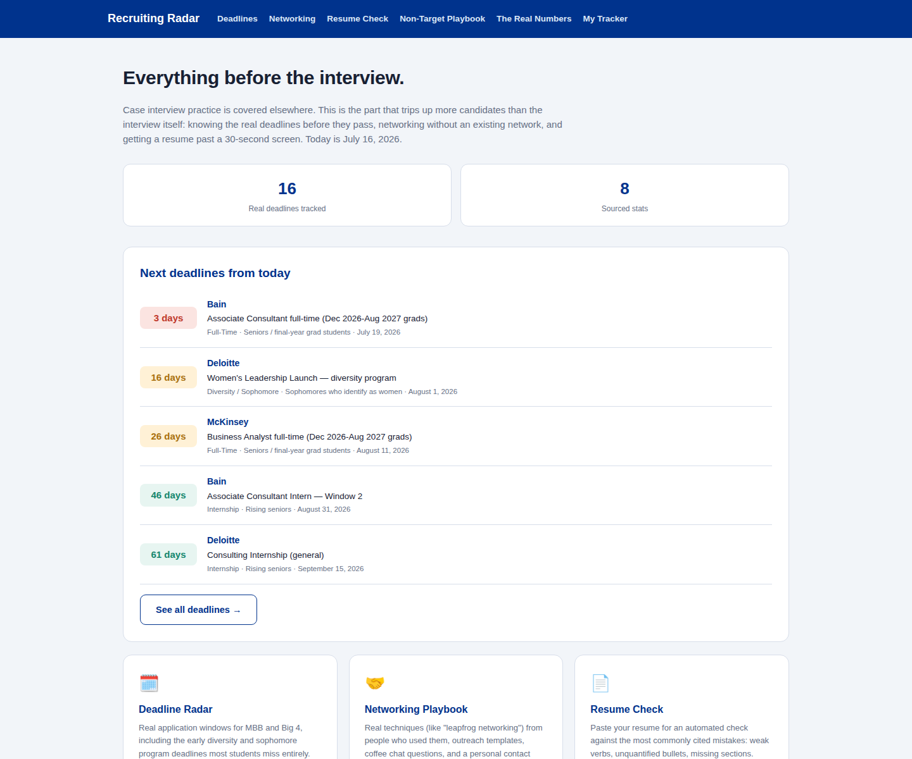
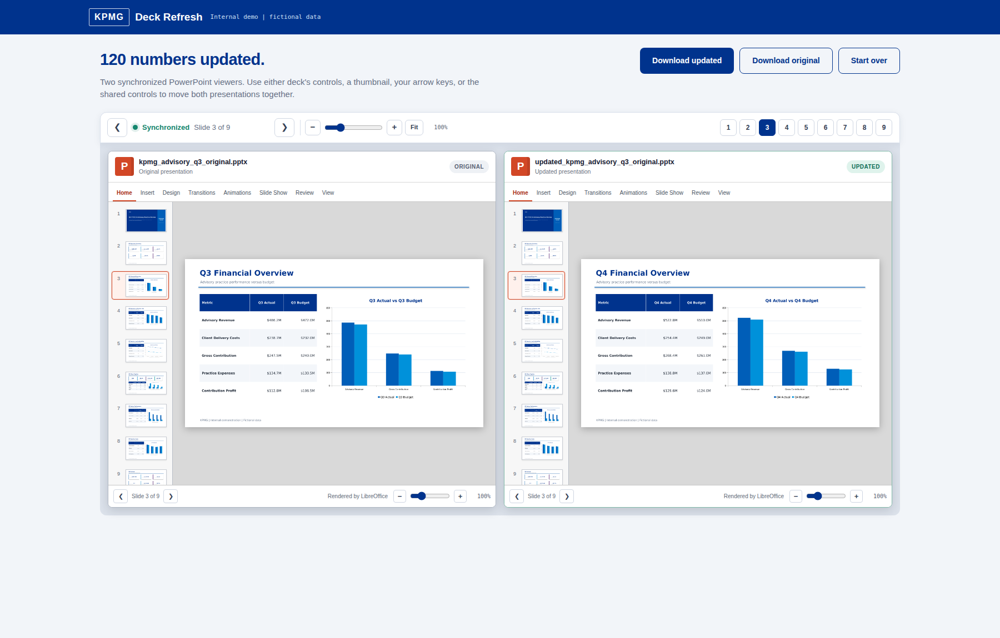

# KPMG Work

A collection of internal tools for automating recurring tasks in quarterly reporting and client deliverable preparation.

All data included is fictional and intended for demonstration purposes only.

## [Case Prep](case-prep/)

A fully in-browser case interview practice platform for consulting interviews. Unlike the other tools here, nothing is downloaded or exported; everything happens on the page. Includes a case library with 9 mock cases modeled after McKinsey, BCG, Bain, Deloitte, PwC, EY, and KPMG interview styles (progressive exhibit reveal, a timer, and model answers to compare against), a framework reference library, a fit/behavioral question bank with STAR guidance, market sizing and mental math drills, and firm-by-firm interview format guides. An optional AI Coach can give feedback using a student's own API key; without one, a rule-based structured self-assessment is used instead, which is a genuinely useful mechanism on its own, not a placeholder.

## [Recruiting Radar](recruiting-radar/)

Everything that happens before a consulting interview: real application deadlines (including the early diversity and sophomore-year programs most students miss entirely), sourced statistics on acceptance rates and resume screening, a networking playbook with real techniques and outreach templates, an automated resume checker, and a non-target/low-GPA playbook. Every fact is sourced, and deadline countdowns are computed live against the actual current date rather than hardcoded. Nothing is downloaded here either; the personal trackers live in the browser session only.

## [Engagement Hub](engagement-hub/)

A workbench combining three tools for recurring engagement work. Each module now shows every generated PowerPoint slide, Excel sheet, and text output directly on the result page before download.

## [Model Auditor](model-auditor/)

Reads an Excel workbook's formulas and finds hardcoded assumptions, inconsistent formulas, circular references, and cached errors. The final page displays every report slide and every annotated workbook sheet before download.

## [Variance Insights](variance-insights/)

Converts a budget-versus-actual data table into a formatted variance analysis slide and workbook, with supporting commentary drafted automatically. The final page shows the generated PowerPoint and every Excel sheet side by side before download.

## [Close Cockpit](close-cockpit/)

Orchestrates a full quarter-close package from a single set of uploads. The result page displays the updated deck, executive package, every workbook sheet, and the follow-up email in one browser workspace before any file is downloaded.

## [Deck Refresh](deck-refresh/)

Updates the numbers in a PowerPoint or Excel file using new source data, while preserving every color, font, layout, and chart. The user uploads a file and the updated figures, reviews the proposed changes, and receives the same file back with the values updated. Includes a synchronized side-by-side viewer that renders the original and updated presentation so changes can be verified before the file is finalized.

## Running any tool

Each folder is a self-contained local Flask application. See the README in each folder for setup instructions. All seven:
- Run entirely on the local machine; no data is transmitted externally
- Include a double-click launcher for Mac and Windows
- Include fictional sample data (or, for Case Prep and Recruiting Radar, built-in content) for immediate use
