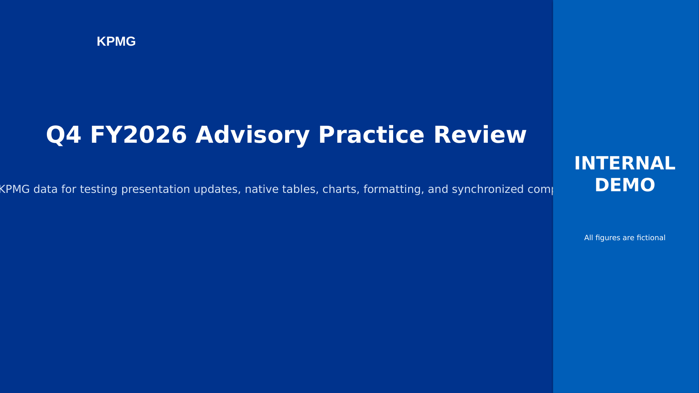
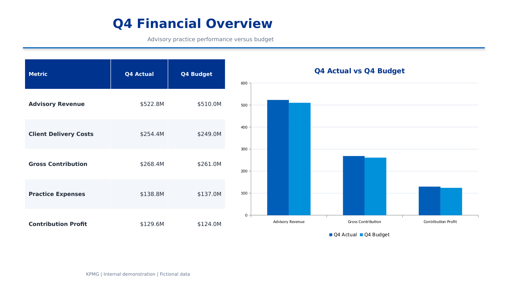

# Deck Refresh

**A local web app that updates the numbers in a PowerPoint or Excel file from new data, while leaving every color, font, layout, and chart exactly as it was.**

Built to solve a real, tedious problem: refreshing a quarterly report deck by hand — retyping numbers into dozens of table cells and charts, one at a time, hoping nothing gets missed or mis-formatted. This app automates that: upload the deck, upload the new numbers, review the matches, and get back the same file with updated figures and no broken formatting.



## What it does

- **Finds every number automatically** — text boxes, table cells, and charts (pie, bar, line) in PowerPoint; cells and charted ranges in Excel — and works out what each one *means* from its surrounding label or row/column header.
- **Matches by meaning, not position** — fuzzy-matches labels against new data (Excel, CSV, another deck, or typed text), so a Q3 deck can be refreshed from Q4 data automatically. It's specifically guarded against the obvious failure mode: a "Costs" figure can never get silently filled in with "Revenue" data just because the row names are similar.
- **Rewrites headings too** — detects the dominant reporting period in the file versus the new data (Q3 → Q4, FY25 → FY26, 2025 → 2026) and updates titles, table headers, and chart labels throughout, not just the numbers.
- **Leaves what it can't confidently match, alone** — anything without a clear match is flagged for manual review rather than guessed at.
- **Shows you the real result before you commit** — a synchronized side-by-side viewer renders the *actual* original and updated PowerPoint (via LibreOffice), with shared slide navigation and zoom, so you can page through both versions in lockstep and see precisely what changed.
- **Preserves the file, not just the data** — PowerPoint charts are updated via `python-pptx`'s native data-replacement API (colors, legend, and chart type untouched); Excel charts are left completely alone and simply pick up the new cell values themselves, since Excel charts are bound to live ranges.



## Tech stack

`Python` · `Flask` · `python-pptx` · `openpyxl` · `pandas` · `RapidFuzz` (fuzzy matching) · `LibreOffice` + `PyMuPDF` (real slide rendering) · vanilla `HTML/CSS/JS` frontend

## Try it

- **Mac:** double-click `Start on Mac.command`
- **Windows:** double-click `Start on Windows.bat`

First run installs everything automatically, then opens the app in your browser. A fictional sample KPMG-styled deck is included in `sample_files/` — upload `kpmg_advisory_q3_original.pptx` along with `kpmg_advisory_q4_data.xlsx` to see it in action immediately.

Manual setup:
```bash
python -m venv venv
source venv/bin/activate   # Windows: venv\Scripts\activate
pip install -r requirements.txt
python app.py
```
Then open `http://127.0.0.1:5050`.

> Real slide-image rendering uses LibreOffice (free, [libreoffice.org](https://www.libreoffice.org/)) if installed, or Microsoft PowerPoint automation on Windows. Without either, the app still fully works — matching, editing, downloading — with a simplified data/chart comparison view instead of rendered slide images.

## Included sample

`sample_files/` contains a fictional 9-slide KPMG-styled advisory practice review (KPI cards, six data tables, six native PowerPoint charts, 120 numeric targets total) and the matching Q4 source data, plus a verified expected output and an automated verification script:

```bash
python tools/verify_sample_update.py
```

Latest verification: **120/120 targets matched**, all table and chart values correct, all headings updated from Q3 to Q4, slide/shape/chart structure fully preserved.

## How it works, briefly

1. Upload the file to update (`.pptx` or `.xlsx`) and your new data.
2. The app extracts every numeric target and its inferred label.
3. Labels are fuzzy-matched against the new data with a keyword-conflict guard (Revenue vs. Costs, Actual vs. Budget, etc. can't cross-contaminate).
4. Reporting-period headings are detected and rewritten to match the new data.
5. You review and confirm matches — edit or skip anything — before anything is written.
6. Compare the real before/after side by side, then download.

All processing is local. Nothing is uploaded to an external service.
