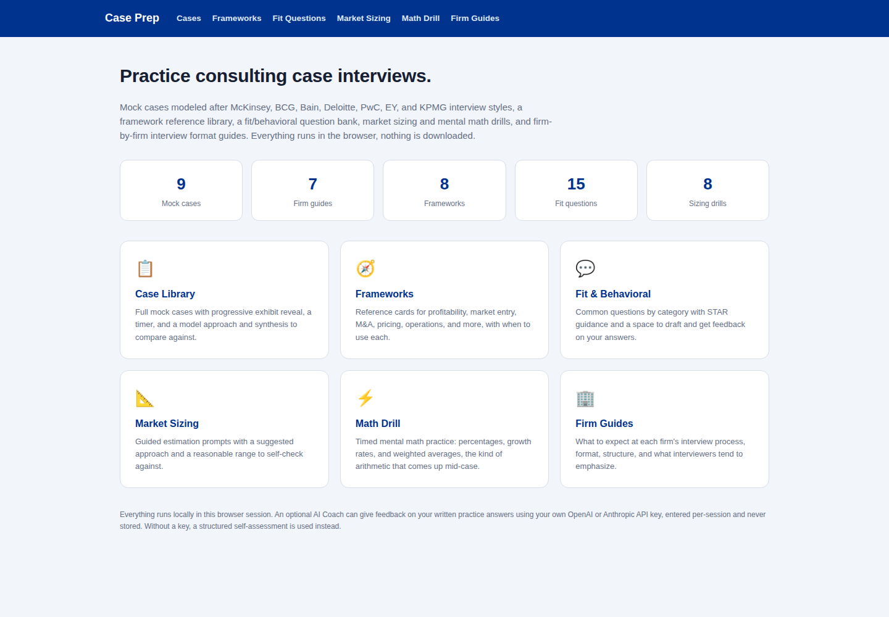

# Case Prep

**A fully in-browser case interview practice platform for consulting interviews. Nothing is downloaded or exported; everything happens on the page.**

This is a different kind of tool from the rest of this repository. The other five generate documents; this one is an interactive learning product: a case library, a framework reference, a fit/behavioral question bank, market sizing and mental math drills, and firm-by-firm interview format guides, covering McKinsey, BCG, Bain, Deloitte, PwC, EY, and KPMG.



## What's included

- **Case Library** (9 mock cases, one modeled after each target firm's known interview style, plus extras covering market sizing and a public-sector case): each case includes a prompt, common clarifying questions, a built-in timer, progressively revealed exhibits, a space to write your own structure and synthesis, and an answer key with a model approach and synthesis to compare against afterward.
- **Frameworks** (8 reference cards): profitability, market entry, M&A/synergies, growth strategy, pricing, operations, 3Cs, and Porter's Five Forces, each with when to use it, its structure, and a common pitfall.
- **Fit & Behavioral Question Bank** (15 questions across 5 categories): motivation, leadership, teamwork, failure/resilience, and impact, each with specific STAR-method guidance, an answer key with an example answer, and a space to draft and get feedback on your own answer. Every category also links to real preparation guides written by former or current consulting employees, see below.
- **Market Sizing Drill** (8 prompts): each with an answer key containing a guided estimation approach and a reasonable range to self-check against, since market sizing is about defensible reasoning, not a single correct number.
- **Math Drill**: timed, randomly generated mental math practice covering percentages, percent change, weighted averages, and quick multiplication, the kind of arithmetic that comes up constantly mid-case. Fully client-side with instant scoring.
- **Firm Guides** (all 7 firms): a summary of each firm's known interview format, what to expect, and specific prep tips, based on publicly available information about each firm's process.

## Answer keys and researched resources

Every practice section has a click-to-reveal answer key rather than requiring a submission first: cases show the model approach and synthesis, market sizing prompts show the suggested estimation approach and a sanity-check range, and fit questions show an illustrative example answer.

The example answers for fit questions are written specifically for this tool to illustrate STAR structure; they are not attributed to any real person. Separately, each fit question category links to real, publicly available preparation guides, several written or reviewed by named former consultants (credited where the source states this), covering McKinsey, BCG, Bain, and Big 4 firms specifically. These are a starting point for further research, not a guarantee of current interview format, firms revise their processes over time.

## The AI Coach (optional)

Every practice area (cases, fit questions, market sizing) can request feedback on a written response. Without any setup, this uses a rule-based structured self-assessment: a length check, a keyword-coverage comparison against the case's model approach, and a fixed checklist of what to verify in your own answer. This is a genuinely different mechanism from AI feedback, not a placeholder for it, and works immediately with no configuration.

If you have your own OpenAI or Anthropic API key, you can paste it in to get real AI-generated feedback instead. The key is sent directly to the provider for that single request and is never stored, logged, or transmitted anywhere else. If the request fails for any reason (invalid key, network issue), the app falls back to the structured self-assessment automatically rather than showing an error with no useful content.

## Setup

- **Mac:** double-click `Start on Mac.command`
- **Windows:** double-click `Start on Windows.bat`

No sample files needed, all content is built in.

Manual setup:
```bash
python -m venv venv
source venv/bin/activate   # Windows: venv\Scripts\activate
pip install -r requirements.txt
python app.py
```
Then open `http://127.0.0.1:5100`.

## Verification

```bash
python tools/verify_content.py
```

Checks that every case, framework, and firm guide has all required content fields, that all slugs are unique, that all 7 target firms are covered by at least one case, that every fit question has an answer key and every category has properly-sourced resource links, and that the rule-based feedback engine produces real output (including that its keyword extraction correctly filters filler words and surfaces genuine content terms). All 20 checks currently pass. Every page route and API endpoint was also tested directly against the running server, including clicking through the answer key toggles with a real browser and confirming the AI Coach's fallback behavior when given an invalid API key (confirmed to fail gracefully to the structured self-assessment rather than erroring out).

## Design notes

- **All company names, case scenarios, and figures are fictional.** The firm interview format descriptions are based on publicly available, general knowledge about how each firm's process is commonly structured, not confidential or insider information.
- **The rule-based feedback path is deliberately not a weaker copy of AI feedback.** It does something AI feedback doesn't: an exact keyword-coverage comparison against the specific model answer for that case, which is a useful, honest signal on its own. A student with no API key still gets real value, not a nag screen asking them to add one.
- **Nothing is downloaded or exported**, consistent with the goal of a self-contained practice tool a student can open and use immediately, in the browser, without producing files to manage.
