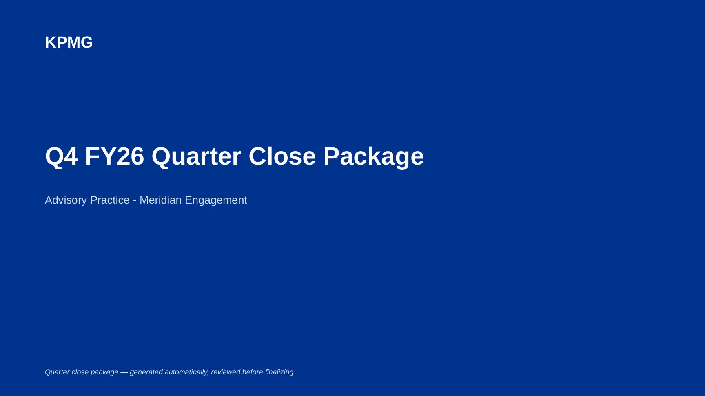

# Close Cockpit

**Runs a full quarter-close package from a single set of uploads: an updated deck, a variance analysis derived from the same numbers, a benchmarking slide, and an action item tracker, assembled into one client-ready package.**

Deck Refresh, Variance Insights, and Engagement Hub each automate one recurring task on an engagement. Close Cockpit orchestrates all of them together in a single run: it reuses the deck-matching engine from Deck Refresh to update the prior-quarter deck, derives a variance analysis directly from the same old-versus-new figures that matching just produced (no separate upload required), and optionally layers in a benchmarking analysis and a meeting-notes-derived action tracker if that data is provided. Every stage is presented for review before anything is generated.



## What it produces

- **Updated deck**: the original file with new figures in place, formatting untouched, using the same guarded matching logic as Deck Refresh.
- **Executive package**: a new, standalone multi-slide deck consisting of a cover slide, an executive summary with KPIs drawn from every stage that ran, a variance detail slide, a benchmarking slide (if peer data was provided), and an action items slide (if meeting notes were provided).
- **Variance workbook, benchmark workbook, action tracker, and follow-up email draft**: the same supporting files each individual tool produces, generated here without a second upload.
- **A single zip file** containing everything, for handoff.


The executive package is deliberately a separate file from the updated deck, not merged into it. Deck Refresh's core guarantee is exact formatting preservation on the original file; inserting new slides into an arbitrary existing presentation risks breaking that guarantee for the sake of a single combined file. The two are meant to be delivered together.

## How the stages connect

1. **Deck matching** (required): the prior-quarter deck and the new data file are matched exactly as in Deck Refresh, including the keyword-conflict guard and period-heading detection.
2. **Variance analysis** (automatic): every matched old/new value pair from stage 1 is reused directly to compute variances, classify them as favorable or unfavorable by metric type, and draft commentary for anything material. The same metric can appear twice in a deck (once in a table, once in a chart); these are detected by identical value pairs and collapsed to a single line so the output doesn't repeat itself.
3. **Benchmarking** (optional): if peer data is uploaded, the target is ranked against the peer set per metric, direction-aware by metric name, same logic as Engagement Hub.
4. **Action tracker** (optional): if meeting notes are provided, action items are extracted the same way as Engagement Hub's Action Tracker, including the same restriction that an owner is only assigned on an explicit attendee-name match.

## Setup

- **Mac:** double-click `Start on Mac.command`
- **Windows:** double-click `Start on Windows.bat`

Sample data for a full run (deck, new data, peer benchmark data, and meeting notes) is included in `sample_files/`.

Manual setup:
```bash
python -m venv venv
source venv/bin/activate   # Windows: venv\Scripts\activate
pip install -r requirements.txt
python app.py
```
Then open `http://127.0.0.1:5080`.

> Rendered slide previews require LibreOffice (free, available at libreoffice.org). Without it, every generated file is still complete and correct; only the in-browser preview is unavailable.

## Verification

```bash
python tools/verify_pipeline.py
```

Runs the full pipeline against the sample data and checks deck matching accuracy, period detection, variance deduplication, benchmarking classification, action item extraction, and rendered-slide layout across every generated file. All 15 checks currently pass.

## Design notes

- **Nothing here claims to know more than the data supports.** Variance commentary states the magnitude and direction of a change and marks where a human explanation is needed; it does not invent a reason. Action items are only assigned to a named attendee, never guessed. These are the same principles used in the individual tools, applied consistently here because orchestrating four stages together is exactly where it would be easiest to let an error compound silently.
- **The deduplication step exists because it was needed.** Testing against the sample deck surfaced that the same metric shown in both a table and a chart produced two near-identical variance commentary lines with reshuffled word order. The fix collapses rows by their underlying value pair before any output is generated, verified by the automated test above.
- All processing takes place locally. No file is transmitted to an external service.
