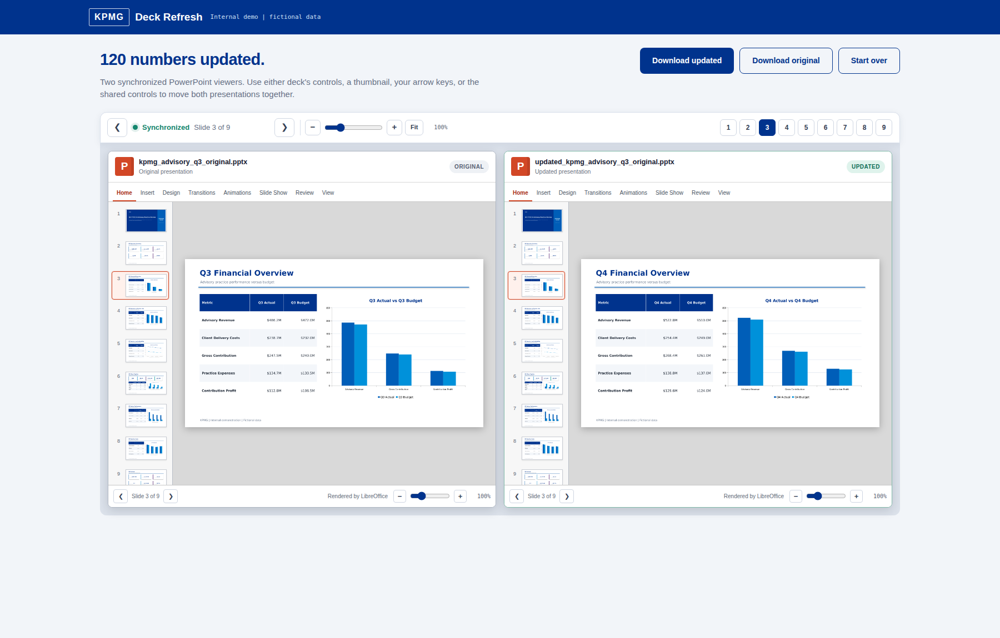
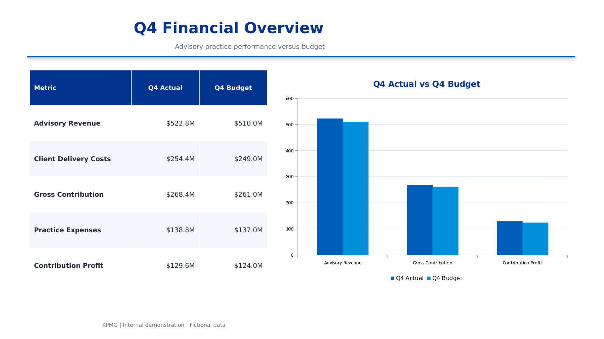

# Deck Refresh

**A local web application that updates the numbers in a PowerPoint or Excel file using new source data, while preserving all existing formatting, layout, and charts.**

Refreshing a quarterly report by hand typically involves retyping figures into table cells and charts one at a time, with a meaningful risk of errors or inconsistent formatting. This application automates that process: the user uploads the file to be updated and the new data, reviews the matched values, and receives the same file back with figures updated and formatting intact.



## Included API configuration

This packaged build already contains a `.env` file. Both launchers load it automatically before starting Deck Refresh. No manual API-key setup is required for this copy.

## What it does

- **Runs a deterministic 1:1 deck refresh from the home page.** Upload a supported analysis presentation and its same-structure replacement workbook. Deck Refresh recalculates the full analysis, validates the proposed output, and pauses on a two-view approval screen. The first view inventories each slide's native charts, tables, KPI figures, data-linked text, series, categories, table dimensions, and mapped-change count. The second view lists every original value beside its replacement. One blanket approval applies the complete mapping. Any output that changes slide count, object geometry, native object types, or the theme is rejected.
- **Identifies every number in the file.** Text boxes, table cells, and charts (pie, bar, and line) in PowerPoint; cells and charted ranges in Excel. Each value is associated with a label inferred from its surrounding text or row and column headers.
- **Matches values by meaning, not position.** Labels are matched against the new data using fuzzy matching, so a Q3 deck can be updated from Q4 data without manual remapping. A keyword-conflict check prevents mismatches such as a "Costs" figure being filled in with "Revenue" data due to similar row names.
- **Updates headings, not just values.** The tool detects the reporting period referenced in the file and in the new data, and if they differ, updates titles, table headers, and chart labels accordingly.
- **Leaves unmatched values unchanged.** Any figure without a confident match is flagged for manual review rather than replaced automatically.
- **Displays the result before it is finalized.** A synchronized viewer renders the original and updated PowerPoint files side by side, using LibreOffice, with shared navigation and zoom so changes can be reviewed slide by slide.
- **Preserves the file structure.** PowerPoint charts are updated using `python-pptx`'s native data-replacement method, which retains colors, legends, and chart type. Excel charts are left untouched; because they reference live cell ranges, they update automatically when the underlying cell values change.



## Tech stack

Python, Flask, python-pptx, openpyxl, pandas, RapidFuzz for fuzzy matching, LibreOffice and PyMuPDF for slide rendering, and a vanilla HTML, CSS, and JavaScript frontend.

## Setup

- **Mac:** double-click `Start on Mac.command`
- **Windows:** double-click `Start on Windows.bat`

The first run installs dependencies automatically and opens the application in a browser. The 1:1 test files and the fictional KPMG-styled sample deck are included in `sample_files/`.

Manual setup:
```bash
python -m venv venv
source venv/bin/activate   # Windows: venv\Scripts\activate
python -m pip install -r requirements.txt
python app.py
```
Then open `http://127.0.0.1:5050`.

> Rendered slide previews work with Microsoft PowerPoint on Windows and macOS. LibreOffice is the cross-platform fallback, and Apple Keynote is a final macOS fallback. On the first Mac preview, macOS may ask whether Terminal or Python may control PowerPoint or Keynote. Choose Allow. If you denied it earlier, open System Settings, Privacy & Security, Automation, enable the permission, then use Retry preview in the editor.

## Included sample

`sample_files/` contains a fictional nine-slide KPMG-styled advisory practice review, including KPI cards, six data tables, six native PowerPoint charts, and 120 numeric targets, along with the corresponding Q4 source data, a verified expected output file, and an automated verification script.

```bash
python tools/verify_sample_update.py
```

Most recent verification result: 120 of 120 targets matched, all table and chart values correct, all headings updated from Q3 to Q4, and slide, shape, and chart structure fully preserved.

## Home-page data replacement

The first workflow on the home page accepts two files:

1. The existing `.pptx` analysis presentation.
2. Any replacement `.xlsx`, `.xlsm`, `.xls`, or `.csv` data file.

Deck Refresh uses three matching levels. Exact analysis profiles rebuild known deep-analysis decks. Similar-variable matching compares worksheet names, row labels, column headers, PowerPoint KPI labels, chart series, chart categories, table headers, and slide context. When wording differs too much, relative-position matching pairs fields within the closest worksheet and PowerPoint object structure. Every relative match displays its source sheet, source field, method, score, and confidence on the validation screen.

Valid files do not stop at an unsupported-deck error. A presentation and workbook with numeric fields receive proposed relative replacements. If either file contains no comparable numeric fields, Deck Refresh still opens the structural validation screen and reports zero proposed changes instead of failing.

The packaged regression files cover both supported deep-analysis formats:

- `Company Screening Analysis.pptx` with `new data screening.xlsx`
- `Goldman Sachs Q3 Analysis.pptx` with `new goldman sachs Q4.xlsx`

All four files are included under `sample_files/`. Both presentations use a formal KPMG visual system with editable KPMG-blue charts, native PowerPoint tables, KPMG title bands, and ten-slide analysis narratives.

Deck identification uses workbook sheet structure and native PowerPoint chart and table positions. It does not depend on hidden wording inside a slide. Reformatted copies therefore remain eligible for the same 1:1 analysis profile. Presentations outside the two deep-analysis profiles use a generic fallback that matches PowerPoint KPI labels, chart categories and series, and table row and column headers to replacement workbook labels. The fallback still pauses on the structure-validation screen before selected or full approval.

The screening refresh reads all 1,810 company rows and rebuilds regional counts, investment-grade mix, business-risk bands, rating-date trends, summary KPIs, and representative-company tables. The Goldman refresh reads all four source sheets and rebuilds coupon totals, scenario paths, price bands, filing date, scenario statistics, and table-of-contents page references.

Both flows first create a validated pending version and display a structure review before any file change. The presentation-structure view inventories editable data objects on every slide. Six safeguards compare slide count, slide size, objects per slide, object positions and sizes, native chart and table signatures, and theme/master files. The proposed-changes view lists old and new chart points, table cells, figures, and narrative fields. Every proposed row has a checkbox, with select all and clear controls for fast review. The user may approve the full mapping or apply only checked rows. Deck Refresh writes the approved values into the existing PowerPoint objects and renders the original and updated presentations on the result page. The flows do not add slides, move shapes, resize charts, replace tables with images, or alter the presentation theme.

The Goldman sample is an explicit quarter test. The presentation is labeled Q3. The companion workbook is labeled Q4 and contains new values in the same four-sheet structure. Applying the full Q4 mapping changes every Q3 reference to Q4 while updating the native charts, tables, KPIs, filing date, and narrative fields.

Run the full home-page replacement test with:

```bash
python tools/verify_one_to_one_replacement.py
```

The test submits both file pairs through the browser route, reopens both outputs, confirms 10 slides in each deck, confirms seven native charts and four native tables across the two outputs, checks expected replacement values, and verifies theme and geometry preservation.

## How it works

1. The user uploads the file to update, in `.pptx` or `.xlsx` format, along with the new data.
2. The application extracts every numeric target and its inferred label.
3. Labels are matched against the new data using fuzzy matching with a keyword-conflict check, so terms such as Revenue, Costs, Actual, and Budget are not cross-matched incorrectly.
4. Reporting-period headings are detected and updated to reflect the new data.
5. The app validates a pending PowerPoint and shows its complete editable data structure by slide.
6. The user reviews every old-to-new mapping grouped by slide and object type.
7. The user checks individual mappings, uses select all or clear when useful, then applies the selected changes.
8. The original and updated files are rendered side by side on the result page.

All processing takes place locally. No file is transmitted to an external service.

## AI PowerPoint editor

Deck Refresh now includes a chat-driven PowerPoint workspace. Open a `.pptx` from the home page, select a slide, and describe the change you want.

The editor supports:

- Live slide previews rendered from the current PowerPoint file on Mac and Windows
- Text replacement, rewriting, appending, bullets, font changes, alignment, margins, wrapping, and automatic text fitting
- Shape creation, duplication, deletion, movement, resizing, rotation, colors, borders, layering, alignment, and distribution
- Image insertion, replacement, cropping, sizing, and rotation from an attached PNG, JPG, or WebP file
- Native PowerPoint tables, including creation, population, styling, cell edits, row and column insertion or deletion, and cell merging or splitting
- Native editable charts, including creation from deck or attached data, data replacement, styling, labels, axes, gridlines, color changes, and chart-type conversion
- A technical New slide inspector for column, bar, line, pie, area, waterfall, and scatter charts
- Separate Design and edit and Edit with AI tabs that use the full right-side workspace
- A guided form for company rebranding
- Deck-wide company changes that replace KPMG text in slides, tables, footers, masters, and layouts
- Slide creation, duplication, deletion, hiding, clearing, regeneration, movement, full-deck reordering, background changes, and slide-size changes
- Speaker notes, footers, deck-wide themes, font and color standardization, color replacement, and cleanup of empty or off-canvas content
- Attached CSV, TSV, XLSX, XLSM, JSON, TXT, and image files inside the chat composer. Data attachments can populate tables or create charts even when the AI service is unavailable
- Full executive-review workflows covering cover cleanup, native charts, analysis callouts, narrative reordering, recommendation slides, risk tables, and deck-wide formatting
- One-operation-at-a-time AI planning with stable PowerPoint shape IDs and semantic object matching
- All-or-nothing chat transactions. The complete requested operation chain is tested on temporary PowerPoint copies and replayed from the untouched current version before a new version is created
- Failure diagnosis and corrective wording. When any requested step still fails after retries, the app identifies the failed step, explains the user-visible reason, suggests a rewritten request for the same task, creates no new version, and leaves the current PowerPoint unchanged
- Undo and redo through versioned `.pptx` files
- Download of the current edited presentation at any point

Each successful request creates a new PowerPoint version. The original upload stays unchanged.

## AI presentation builder and side inspector

Choose **Build a presentation from scratch** on the home page, or select **New slide** from any open deck. The builder opens a focused native-chart setup screen.

Choose a column, bar, line, pie, area, waterfall, or scatter chart. Then choose **Blank chart** or **Use Excel data**. Blank mode creates a native chart canvas with embedded editable data and no sample business takeaway. Excel mode detects headers, dates, percentages, currencies, totals, categories, and likely X and Y series before creating the selected chart type.

Use `sample_files/Deck-Refresh-Chart-Test-Data.xlsx` to test every chart type. It contains 12 months of revenue, cost, profit, and budget data plus a detected total row. The workbook also includes a short test guide. Run `python tools/verify_chart_sample_data.py` to confirm all seven chart types receive the exact source values as editable native PowerPoint data.

Imported charts use chart-specific presentation rules. Pie charts receive distinct slice colors, white separators, percentage labels, and a category legend. Column, bar, line, area, waterfall, and scatter charts receive readable axes, currency or percentage formats, series colors, legends, markers, and layouts suited to the selected chart type. The built-in preview renderer follows the same chart-type distinctions when desktop PowerPoint or LibreOffice rendering is unavailable.

The broader 32-layout engine remains available to AI chat requests. All generated tables, charts, text, and shapes remain editable in PowerPoint.

The simplified side inspector sits beside the rendered slide and exposes the most-used controls:

- One theme selector with **Apply to this slide** and **Apply to whole deck** buttons
- Direct primary, accent, and background controls under **Custom colors**
- Seven native chart slide types with blank or Excel data modes
- Excel and CSV import plus native chart conversion
- Company-name replacement, with core slide actions kept in the top toolbar

The AI tab continues to accept the broader editing command set, including table creation and editing. New charts and tables find open space automatically and reflow crowded slide content before insertion.

Chart conversion reuses the chart's embedded workbook. The user does not need to upload the source spreadsheet again. Button actions also appear as chat instructions, so users may perform the same edits by typing requests such as `Convert this chart into a line graph`, `Sort the table by impact`, `Make every chart green`, or `Merge slides 5 and 6`.

Run the builder and inspector regression suite with:

```bash
python tools/verify_builder_workspace.py
python tools/verify_every_button.py
python tools/verify_interface_controls.py
```

`verify_every_button.py` executes every inspector command, builds all 32 slide
types, and reproduces the slide-30 chart and executive-rewrite requests through
the same local compiler used by the browser controls. It also rejects template
output containing empty filler such as `TBD`, `Drop image`, or import-only boxes.
`verify_interface_controls.py` checks every visible button hook and exercises the
toolbar, blank-chart builder, Excel-chart builder, chat, theme, download, and
one-slide deletion routes.

Failure responses use this format:

```text
error cant do that

What failed: Resolving the source slide
Why: The current presentation has 8 slides, so slide 9 does not exist.
Try: "Move slide 8 to position 4."

PowerPoint was not changed.
```

### OpenAI setup

This packaged copy already includes its `.env` configuration. Both launchers load it automatically. The `.env` file remains excluded from Git. The app sends the deck structure, recent chat context, and slide preview images to the OpenAI API when chat editing is used. Broad requests are split into focused tasks. Every task is planned one compact operation at a time, so no single response needs to contain a large edit-plan object. Each operation is validated before it is accepted. Invalid references are repaired using stable PowerPoint shape IDs and semantic text matching.

Full executive-review prompts use one local multi-pass workflow. The workflow removes demo language, rewrites the cover, adds two native charts from existing figures, adds executive callouts, reorders the narrative by slide purpose, creates a four-card recommendations slide, creates a five-row native risk table with red, amber, and green indicators, standardizes the deck, removes exact duplicate slides, and verifies that all objects remain inside the slide canvas. This path does not depend on a long model response and continues even when the API is unavailable.

For other requests, the editor uses a model-based language interpreter, a second coverage review for compound requests, task-level retries, and a final full-chain replay. It never commits a partial chat request. Direct slide controls do not call the API.

Run the AI editor regression suite with:

```bash
python tools/verify_ai_editor.py
```

The suite executes the full long-form executive request against the included sample deck and verifies the 11-slide output, two native charts, recommendations cards, editable risk table, narrative reorder, disclaimer removal, PowerPoint reopen, and no skipped operations.


Run the comprehensive universal editor test with:

```bash
python tools/verify_universal_editor.py
```

This suite exercises text, colors, shapes, lines, alignment, layering, tables, charts, images, speaker notes, slide regeneration, slide hiding, themes, footers, slide sizing, transactional rollback, and PowerPoint reopen checks. It also injects an invalid operation and verifies that the remaining edits still complete.

PowerPoint features that `python-pptx` does not safely rewrite, such as VBA macros, animation timelines, transitions, SmartArt internals, embedded OLE applications, and slide-master logic, are preserved when possible. A request aimed only at one of those unsupported internals leaves the deck unchanged and returns a normal chat response instead of a server error. External images must be attached in the chat composer.

The browser preview uses Microsoft PowerPoint on Windows and macOS when available. On Mac, Deck Refresh exports the current PPTX through PowerPoint and converts each exported PDF page into a live slide image. LibreOffice remains the cross-platform fallback, and Apple Keynote is a final Mac fallback. A built-in PowerPoint renderer now provides a final always-available preview when every desktop renderer is missing or temporarily fails. Every successful edit renders into a temporary folder and replaces the visible images only after the complete new preview is ready. The browser cache is invalidated for every version, and failed image loads trigger automatic preview recovery attempts. A failed render therefore cannot permanently disable later previews.

### Deterministic slide commands

Clear slide-management commands run locally and do not depend on the AI planner. Examples include:

```text
delete last slide
delete current slide
delete slides 2 and 4
delete slides 3 through 5
move slide 8 to slide 4
move this slide right
move slide 8 before slide 4
move slide 2 after slide 4
swap slides 2 and 5
duplicate last slide
add blank slide after slide 2
reorder slides to 1, 2, 3, 4, 5, 6, 8, 7
```

The editor validates each command against the current slide count. Invalid requests leave the deck and version number unchanged. The response begins with `error cant do that`, identifies the failed step, and gives wording to retry the same intended task.

Run the chat-command regression suite with:

```bash
python tools/verify_chat_commands.py
```

## Conversational AI commands

The editor now runs every chat request through a natural-language interpreter before creating PowerPoint operations. You do not need to use exact command wording.

It supports:

- Compound instructions, such as `duplicate slide 4 and then move that new slide to the end`.
- Follow-up references, such as `move it before the recommendations page`.
- Approximate titles, such as `put the pipeline page before the financial overview`.
- Typos, shorthand, slang, missing punctuation, and multilingual requests.
- Mixed requests containing slide management, content rewriting, colors, tables, charts, pictures, and formatting.

The interpreter converts each message into small ordered tasks. A second language pass checks compound requests for missing steps. Each task is retried with validation feedback when needed. The entire chain is then replayed against a temporary copy of the untouched current PowerPoint. A new version is created only when every requested step succeeds. Any remaining failure begins with `error cant do that`, reports what failed and why, suggests a clearer command for the same task, and keeps the PowerPoint unchanged.

## Reliability update

Basic slide-management requests run through a deterministic local router before the conversational AI layer. This includes deleting, duplicating, moving, swapping, reordering, and adding slides. Common polite wording, references such as last/final/current, page/slide synonyms, and harmless phrases such as “in the deck” are normalized locally. Every operation is validated on a temporary PowerPoint copy before a new version is saved.

## 30-slide conversational editor validation

The package includes a serious 30-slide advisory steering committee deck:

- `sample_files/kpmg_advisory_30_slide_original.pptx`
- `sample_files/kpmg_advisory_30_slide_data.xlsx`
- `sample_files/kpmg_advisory_30_slide_expected.pptx`
- `sample_files/showcase_commands.txt`

Run the full conversational regression suite:

```bash
python tools/verify_30_slide_editor.py
```

The suite validates 18 editing scenarios across deletion, duplication, movement, swapping, executive rewriting, formatting, callouts, editable tables, editable charts, slide creation, regeneration, whole-deck cleanup, compound instructions, pronouns, risk-slide matching, preview rendering, and safe invalid-reference handling.


## Themes and colors

The editor now includes a Theme control in the top toolbar. Choose a preset, choose Whole deck or Current slide, then select Apply theme.

Included presets:

- Deck Refresh Blue
- Executive Dark
- Performance Green
- Warm Neutral
- Ocean
- Purple
- Monochrome
- High Contrast

Choose Custom colors to set a primary color, accent color, and background color.

The chat editor also understands requests such as:

```text
Apply the Executive Dark theme to the entire deck.
Use a navy, teal, and light gray palette on slide 4 with a white background.
Change the background to black and body text to white on slide 2.
Change all chart colors to green, dark blue, and light blue.
Change every orange shape to green across the entire deck.
```

Theme changes update visible slide backgrounds, title and body text, editable shapes, borders, editable tables, and editable chart series. Pictures and logos remain unchanged. Red, amber, and green status colors remain unchanged unless the request explicitly asks to replace them.

PowerPoint master-theme XML, third-party embedded objects, and image pixels are preserved rather than rewritten. Use Undo to restore the prior theme version.
