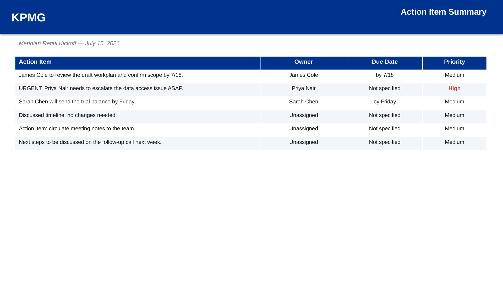
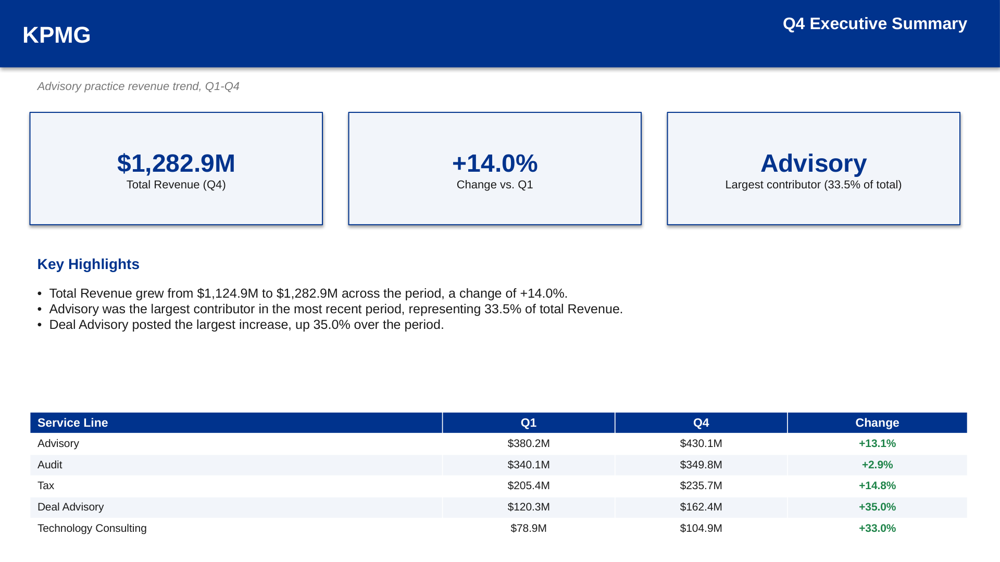

# Engagement Hub

**A consulting workbench combining three tools for recurring engagement work: converting meeting notes into a tracked action list, converting a data table into an executive summary, and benchmarking a client against a peer set.**

Each module addresses a task that recurs across most client engagements and is typically performed manually. The application automates the calculation and drafting portions of each task and presents the result for review before any file is generated.



## Modules

### Action Tracker

Converts meeting notes into a structured, reviewed action item list. Notes are scanned for bullet points, attendee names, due dates, and common action phrasing ("will send," "needs to," "follow up"). Each candidate item is presented for review, with the option to edit the text, owner, due date, or priority, or exclude it entirely, before three outputs are generated: an Excel action item tracker, a follow-up email draft grouped by owner, and a one-page summary slide.

Owner assignment only occurs when an attendee's name is explicitly present in a line. The tool does not guess an owner from capitalization patterns, since an incorrect assignment is worse than leaving an item unassigned for manual review.



### Executive Summary

Converts a period-over-period data table into a KPI-and-narrative executive summary slide. Given a label column and two or more numeric columns representing periods in chronological order, the tool calculates total change over the period, identifies the largest contributor and the largest positive and negative movers, and drafts narrative bullets describing each. Each bullet is presented for review and can be edited or excluded before the slide and workbook are generated.


### Benchmarking

Compares a target company's metrics against a peer set and produces a quartile-ranked benchmarking slide and workbook. For each metric, the tool determines whether a higher or lower value is favorable based on the metric's name (for example, revenue and margin metrics are evaluated as higher-is-better, while cost and expense metrics are evaluated as lower-is-better), calculates the target's percentile rank against the peer set accordingly, and classifies the result into a quartile.

## Setup

- **Mac:** double-click `Start on Mac.command`
- **Windows:** double-click `Start on Windows.bat`

Sample data is included for all three modules in `sample_files/`, using a fictional client engagement.

Manual setup:
```bash
python -m venv venv
source venv/bin/activate   # Windows: venv\Scripts\activate
pip install -r requirements.txt
python app.py
```
Then open `http://127.0.0.1:5070`.

> Each result page previews every generated file. On Windows, PowerPoint renders the slides when installed. LibreOffice is the fallback on other systems. If neither renderer is available, the browser still shows the slide text, tables, and chart data. Excel sheets and email drafts remain fully viewable in the browser.

## Verification

An automated script checks each module's output against the sample data, including a rendering check that verifies generated slides contain no off-slide or overlapping text.

```bash
python tools/verify_samples.py
```

## Design notes

- **Each module produces a reviewable draft, not a final answer.** Meeting-note parsing, trend narratives, and benchmarking commentary all depend on context a spreadsheet or transcript cannot fully provide. Every output is presented for review, with the ability to edit or exclude individual items, before a file is generated.
- **Classification is based on the wording of each row, not on hardcoded assumptions.** A metric or line item named "Revenue" and one named "Costs" are evaluated in opposite directions automatically, based on the same keyword logic used in Variance Insights.
- All processing takes place locally. No file is transmitted to an external service.
