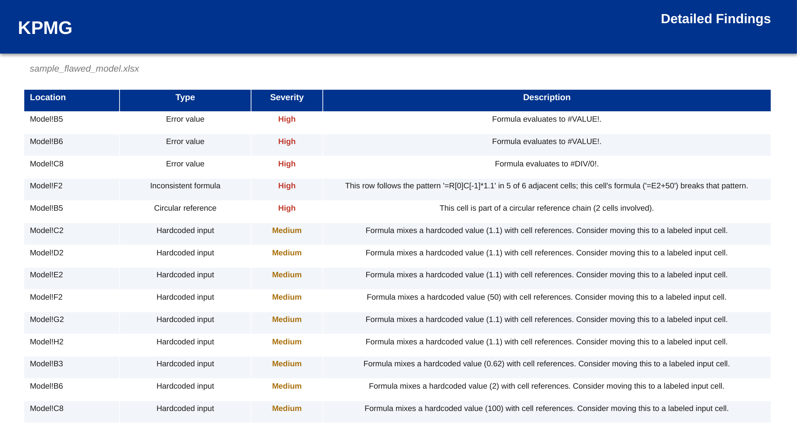

# Model Auditor

**Reads an Excel workbook's actual formulas, not just its values, and finds the kinds of errors that show up in real financial model reviews.**

Every other tool in this repository works with cell *values*: reading a number, matching it, updating it. This one works with formula *structure*, which is a different problem: it parses formula syntax, builds a cell dependency graph, and compares the "shape" of formulas across a row or column to find where one breaks the pattern of its neighbors. This is closer to what a technical review of a financial model actually involves, whether for due diligence, an internal QC pass, or handing a model off to someone else.


## What it checks for

- **Hardcoded inputs mixed into formulas**: a formula like `=B5*1.05` embeds an assumption (the 1.05) directly in a calculation instead of referencing a separate, labeled input cell. This is one of the most common and most consequential modeling errors, since the assumption becomes invisible and easy to miss when someone reviews or updates the model later.
- **Formulas that break the pattern of their row or column**: if `C5` through `L5` all follow the same formula structure and `H5` doesn't, that's very often a copy-paste error or a manual override that never got reverted. The check normalizes each formula's cell references to their position relative to the current cell, so it can recognize "the same formula pattern" even though each cell points at different cells, and flags whichever one doesn't match the majority pattern in its run.
- **Circular references**: built by constructing a full cell dependency graph across every sheet and detecting cycles, not just relying on Excel's own circular reference warning, which some workbooks have suppressed.
- **Cached error values**: `#REF!`, `#DIV/0!`, `#N/A`, `#VALUE!`, `#NAME?`, `#NULL!`, `#NUM!`, wherever they appear in the workbook's last-saved state.

## What it produces

- **A model health report** (PowerPoint): a 0-100 health score with a letter grade, findings broken out by type and severity, and a detailed findings table.
- **An annotated copy of the workbook** (Excel): every flagged cell is highlighted by severity and carries a comment explaining the finding, plus a dedicated Audit Findings sheet listing everything in one place. The original workbook itself is untouched; this is a separate file.



## Setup

- **Mac:** double-click `Start on Mac.command`
- **Windows:** double-click `Start on Windows.bat`

Two sample workbooks are included: `sample_flawed_model.xlsx`, which has one deliberate bug planted in each detection category, and `sample_clean_model.xlsx`, a well-built model with none, used to confirm the scanner doesn't flag things that aren't actually wrong.

Manual setup:
```bash
python -m venv venv
source venv/bin/activate   # Windows: venv\Scripts\activate
pip install -r requirements.txt
python app.py
```
Then open `http://127.0.0.1:5090`.

> The result page previews every report slide and every annotated workbook sheet. On Windows, PowerPoint renders the slides when installed. LibreOffice is the fallback on other systems. If neither renderer is available, the browser still shows the report text, tables, and chart data.

## Verification

```bash
python tools/verify_scanner.py
```

Runs the scanner against both sample workbooks and checks that every planted bug in the flawed model is actually found, that the clean model produces zero false positives, and that the generated report and annotated workbook are structurally correct. All 12 checks currently pass.

## Design notes

- **The row/column consistency check requires a minimum run length and a clear majority pattern before it flags anything.** A short run of formulas, or a range with no dominant pattern, is more likely to be genuinely varied than broken, and flagging it would just be noise. The threshold (minimum 4 adjacent cells, at least 60% following the same pattern) is a deliberate trade-off toward fewer, more trustworthy findings.
- **Hardcoded-literal detection excludes bare 1 and -1.** These overwhelmingly appear in formulas for structural reasons (offsets, sign flips) rather than as genuine assumptions, and including them made the findings list noisy without adding real signal.
- **Circular reference detection reports one representative cell per cycle**, not every cell involved, consistent with how the finding is actually used: to tell someone where to start looking, not to flag the same problem N times.
- All processing takes place locally. No file is transmitted to an external service.
